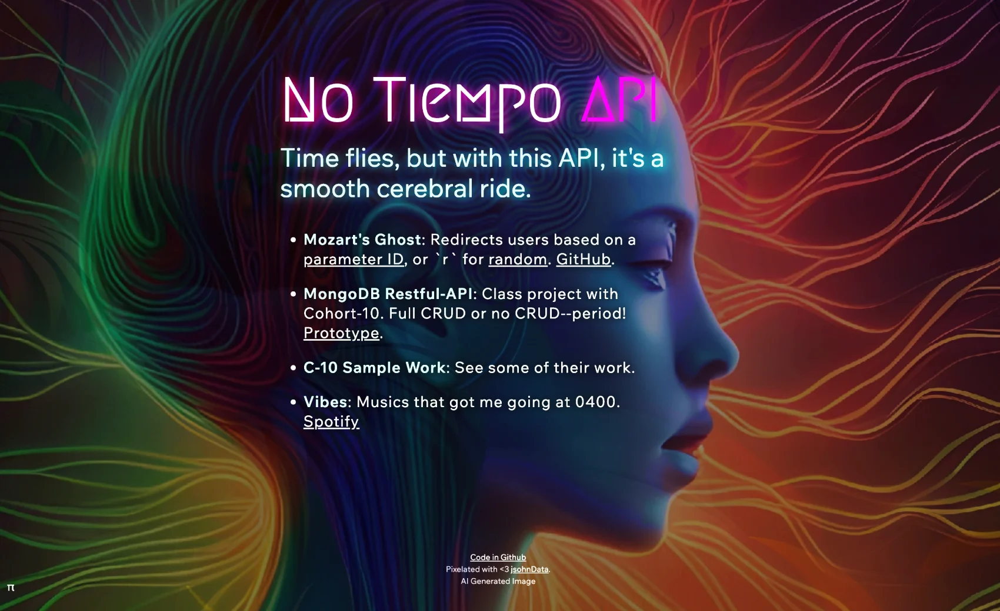

# No Tiempo API
[](https://notiempo.lol)
This is an Express API that enables CRUD operations on MongoDB, as well as serving AI-generated images and other related services. It is deployed on Firebase, hosted on the Google Cloud Platform (GCP), and exclusively dedicated to Cohort 10 (C-10)...period!

## Website
* 👉 [notiempo.lol](https://notiempo.lol)

## How To Add

In the footer
```
<p id="mozarts-ghost"><a href="https://notiempo.lol/mozartsghost/18"
  rel="noreferrer"
  alt="Click on it and press control-shift."
  title="Click on it and press control-shift.">π</a></p>
```

.css
```
#mozarts-ghost {
  position: fixed;
  opacity: 1;
  bottom: 0;
  left: 10px;
  padding: 10px;
}

#mozarts-ghost a:link,
#mozarts-ghost a:visited {
  color: rgb(164, 164, 235);
  text-decoration: none;
}

#mozarts-ghost a:hover {
  color: rgb(195, 0, 255);
}
```